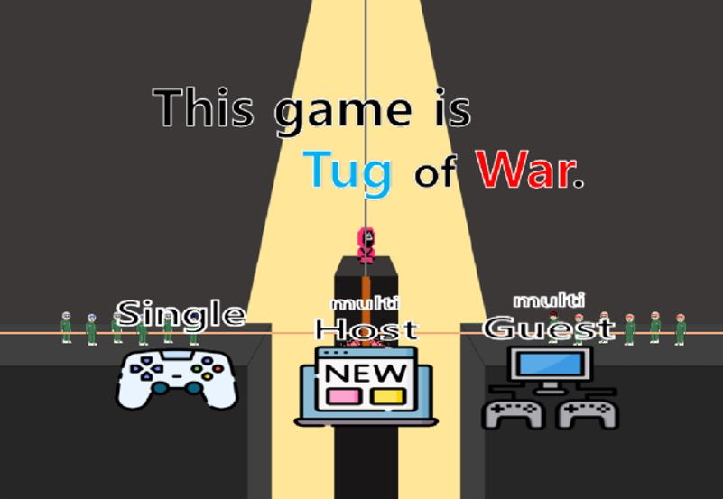

- **period:** 2023-03-01 ~ 2023-06-16
- I used Java to recreate the tug-of-war game from Netflix's "Squid Game."
- This is a project I did in the "Object-Oriented Programming" course for the first semester of 2023.
