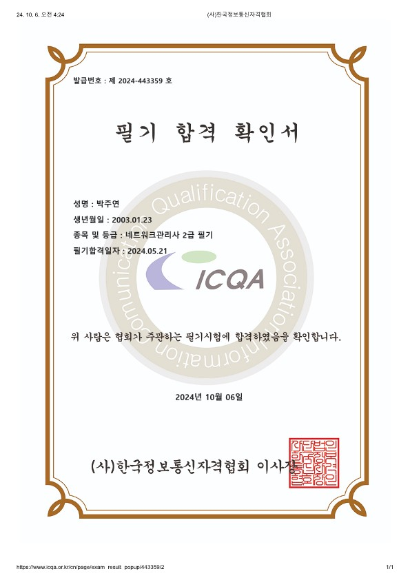

## 내가 취득한 자격증

### 네트워크 관리사 2급 필기

- **발급 기관**: [기관명 A]
- **취득 날짜**: YYYY-MM-DD
- **자격증 설명**: 자격증 A에 대한 간단한 설명입니다. 이 자격증은 XX 분야에서 중요한 역할을 하며, YY에 대한 전문성을 인증합니다.

---

### 2. 리눅스 마스터 2급

- **발급 기관**: [기관명 B]
- **취득 날짜**: YYYY-MM-DD
- **자격증 설명**: 자격증 B에 대한 간단한 설명입니다. 이 자격증은 XX 분야에서 중요한 역할을 하며, YY에 대한 전문성을 인증합니다.

---
