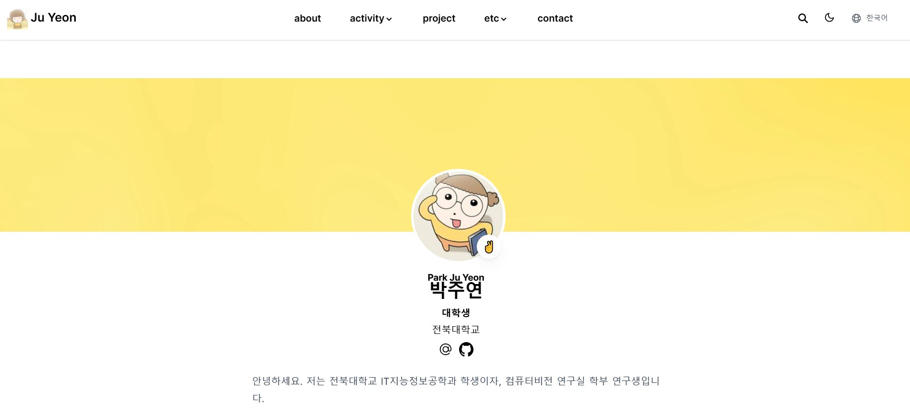

- **진행 기간:** 2024-09-19 ~ 2024-10-06
- 2024학년도 2학기 OSS 과목에서 진행한 개인 포트폴리오 웹사이트 프로젝트입니다.
- 선택한 템플릿은 css, html, 등의 개별적인 코드와 메뉴 탭조차 존재하지 않아 처음부터 구현해야했습니다. 템플릿으로 인해 불편함을 느껴 교체해야겠다고 생각했을 땐 이미 기간 내 커밋 제한을 수행하지 못하게 되는 상황이라 그대로 진행했습니다. 결국, 완성되지 못한 형태로 프로젝트를 끝마치게 되어 아쉬움이 많이 남는 프로젝트입니다.
- 프로젝트 수행 기간 이후 새로운 템플릿으로 다시 구현해보는 게 저의 목표입니다.
- [포트폴리오 보러가기](https://juyeon777.github.io/OSS-portfolio/)
